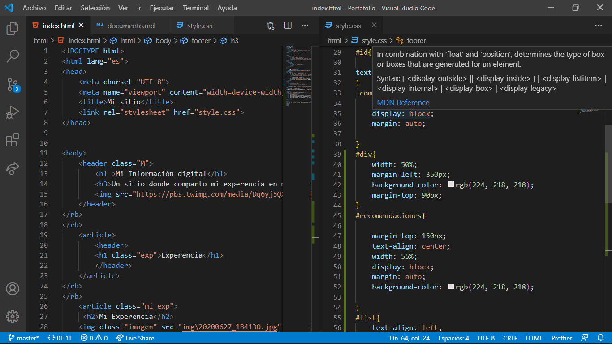
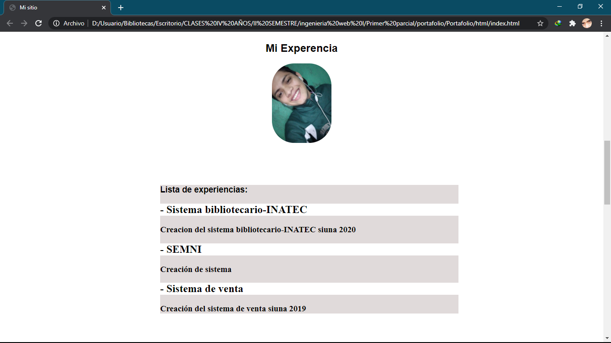
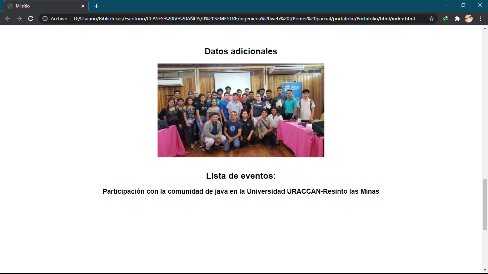
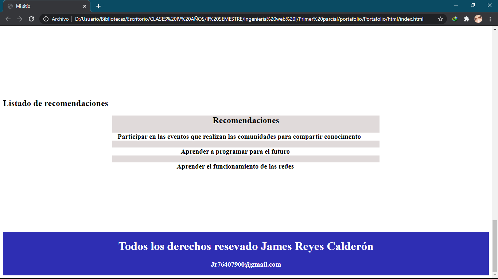

## Como construir una maquetacion con html y css

Para construir una maquetacion lo que utlilizamos tal a como lo dice el titulo fue html con css externo dando le uso a la mayoria de las etiquetas que estasmos poniendo en practica.

Por ejemplo podemos apreciar en la miniatura el uso de etiquetas en html y el estilo que ibamos aplicando cada una de ella:

En esta siguiente imagen podemos observar el resultado  del trabajo que realizamos a puras etiquetas con ayuda del css 

  
  

Puedo decir para concluir que la verdad creo que me quedo muy bien a mi criterio pero me tomo mi tiempo pero es bastante interesante.